# RaspberryPi-HomeKeeper

The other day, when I came back home, I found that the window is opend by someone.
Perhaps he(maybe thief) opened the window for looking around the house. Fortunately, the thief did not steal anything.
I decided to make a video monitoring system that automatically alarms to me when it catches unnormal signs.</br>
Several years have gone since I wrote a book about Raspberry Pi.
In the book, I introduced Node-RED Visual coding tool, GStreamer steamming module to make a home monitoring system.
But now we can build a more powerful video monitoring system with motioneye, cloud service like Google Driver(or your NAS), mobile push services.
The contents in this article is not my own. Many predecessors have written excellent articles, programming codes already.
I just combined these results of them and some of my experience.
</br></br>

## Raspberry Pi 3B, CSI Camera V 1.3(or 2.X)
I prepared Pi 3 because it supports Wifi. (Surely you can use Pi 3+, Pi4, Pi Zero W) You might don't want to see LAN cables across the living room, kitchen, rooms. I also don't want to do LAN cable installation. Using Wifi, you can locate this video monitoring system anywhere you want easily.
MotionEye supports both USB Webcam, Pi CSI Camera. So you can choose any of them or even two of them.(motionEye supports multiple camera!)
</br></br>


## motionEyeOS or Rasbian OS + motionEye

I first downloaded motioneyeOS from https://github.com/ccrisan/motioneyeos/releases and made SD card. 
I followed the instructions of https://github.com/ccrisan/motioneyeos/wiki/Wifi-Preconfiguration to use Wifi. I do the job both Windows and Linux, but I can't connect to my Wifi router.(My another headerless Rasbian image successfully connected to the router)
After some googling, I decided to use official Rasbian OS. Because I'm much familiar with official Rasbian.
</br></br>

## Rasbian OS installation and follow-up settings
1. Download Rasbian Lite version at https://www.raspberrypi.org/downloads/raspbian/
2. Prepare a microSD card(class 10, 16GB or higher recommanded) and burn an image with Win32Diskeeper or Etcher.
3. Do headless wifi setup that I explained at https://github.com/raspberry-pi-maker/RaspberryPi-For-Makers/blob/master/tips/chap-01/headless_setup.md.
If you are not Korean, You can find many many pages at google. Just type \"raspberry pi headless wifi setup\"
4. Do headless ssh setup that I explained at https://github.com/raspberry-pi-maker/RaspberryPi-For-Makers/blob/master/tips/chap-01/headless_setup.md.
5. Boot your raspberry pi with camera and find the IP address of it using Angry IP Scanner or nmap tools
6. run ssh client tool from your laptop and access the raspberry pi.
7. run raspi-config and enable the CSI camera
8. run raspi-config and do what you want to set up and reboot the system. </br></br> 

## motionEye install
You can find all installation procedure at https://github.com/ccrisan/motioneye/wiki/Install-On-Raspbian.  
>⚠️ ***Warning***: install with root account, don't install with sudo command. Do like this. Because motioneye installation checks and uses the current user's home directory. So using root account is a better choice. 
```console
$sudo su -  
#apt-get install ffmpeg libmariadb3 libpq5 libmicrohttpd12  
#...... 
```
</br></br>

## connect the motioneye  with your web browser
If you have done the above procedures without any errors, You can access motionEye with your web browser. motioneye use port 8765, so type "ip address:8765" in your browser. You may see the motioneye web pages.</br></br>
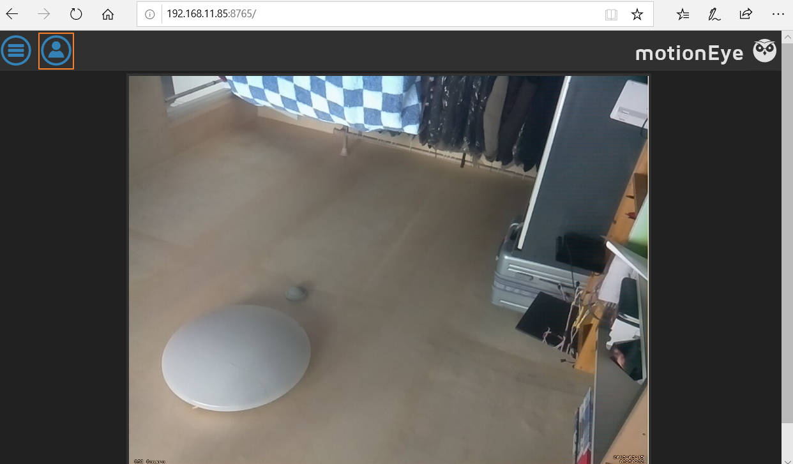<br />

#### login
You should log in as an admin. Press a human like icon in the upper left corner to log in. 
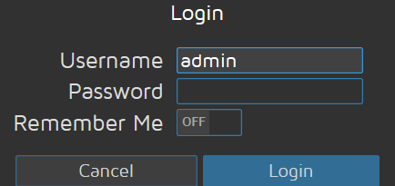<br /><br />
Default admin account is Username "admin" and no Password. As an admin, you can setup motioneye's camera, resolution, motion detection, storing videos, etc.
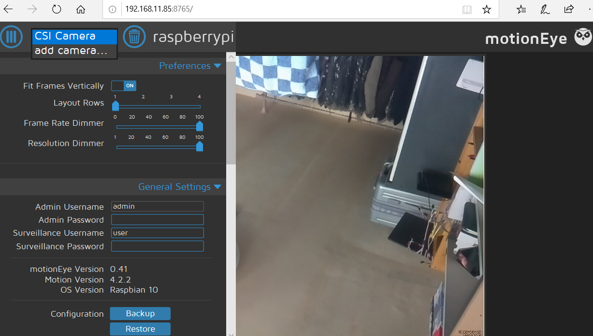<br />

#### add camera
If you can't see the captured video screen, you can add cameras manually.
* If you want to add an USB Webcam, select local V4L2 Camera.
* If you want to add an CSI Pi Camera, select local MMAL Camera.<br /><br />
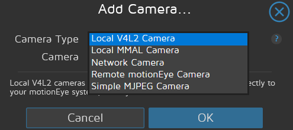<br /><br />
Now you should see the captured video, check your camera is connected correctly.
>⚠️ ***Tip***
* Run raspi-config and check if CSI camera is enabled
* If you use an webcam, run lsusb command to check the webcam device
* Run raspi-still -o /tmp/test.jpg to capture a test still image.<br /><br />

#### general settings
There's an excellent video clip at Youtube. You can get a lot of motioneye information from this video.
[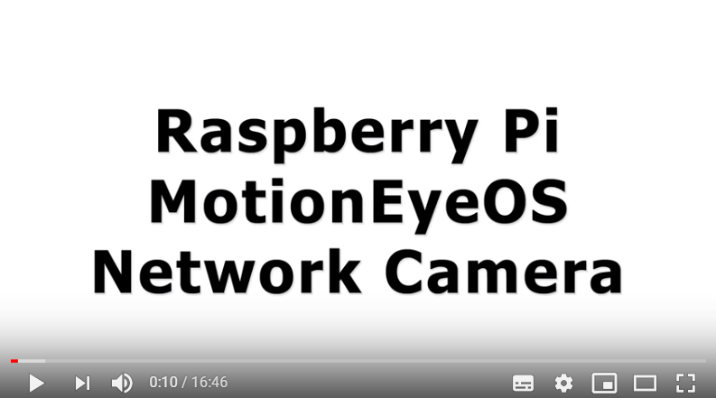](https://youtu.be/8YUM7jio6dk)<br /><br />


## Prepare remote storage
As you know, raspberry pi use a micro sd card as its storage. If you want to store the captured videos, they may occupy a lot of capacity. So you should care about storage usage. If you have a NAS in your home, it's a good choice to store captured videos, images to your NAS instead of local sd card. If you don't have, you may consider using cloud storage like Google Drive, Microsoft OneDrive, DropBox ...</br></br>

#### NAS setup
I'm using a Western DIgitals MyCloud NAS. Today many NAS venders provides remote access services using many devices like PC, smartphone, tablet. So I store the videos, images on the NAS, I can freely access the data from the outside using my phone. If you use another NAS, you may do the same job with their manuals.

1. Connect NAS from WebBrowser http://wdmycloud.local/UI/ and log in with your account
2. Go to "Shares" and click "Create a new shares icon" at bottom left and give a share name(I used HomeKeeper). This may create a new directory (/shares/share name) and shares it with users whom already registered.
3. Now it's time to setup your raspberry pi. This is the same process as a normal disk mount job. 
>* create a mount directory
```console
sudo mkdir /mnt/HomeKeeper
```
>* modify fstab for NAS mount. Add this line to /etc/fstab file. 192.168.11.51 is NAS ip address</br>
```console
192.168.11.51:/nfs/HomeKeeper /mnt/HomeKeeper nfs nouser,atime,auto,rw,dev,exec,suid 0   0
```
>* Reboot your pi and test at pi
```console
pi@raspberrypi:~ $ cd /mnt/HomeKeeper/
pi@raspberrypi:/mnt/HomeKeeper $ ls -al
total 12
drwxrwxrwx+ 2 root   pi   4096 Sep 15 18:18 .
drwxr-xr-x  3 root   root 4096 Sep 15 16:36 ..
pi@raspberrypi:/mnt/HomeKeeper $ touch Hello
pi@raspberrypi:/mnt/HomeKeeper $ ls -al
total 12
drwxrwxrwx+ 2 root   pi   4096 Sep 15 18:18 .
drwxr-xr-x  3 root   root 4096 Sep 15 16:36 ..
-rw-r--r--  1 nobody pi      0 Sep 15 18:18 Hello
```
>* Verify that the Hello file exists on the NAS
```console
WDMyCloud:/# ls -al /shares/HomeKeeper/
total 12
drwxrwxrwx+ 2 root   share 4096 Sep 15 18:18 .
drwxrwxr-x  9 root   share 4096 Sep 15 16:31 ..
-rw-r--r--  1 nobody share    0 Sep 15 18:18 Hello
```
</br></br>

## finishing the motioneye setup 
Now you can store big size video files on your NAS. It's time to finish the motioneye setup. 

#### motion detection
If there's no movement, you don't have to store motionless videos.  
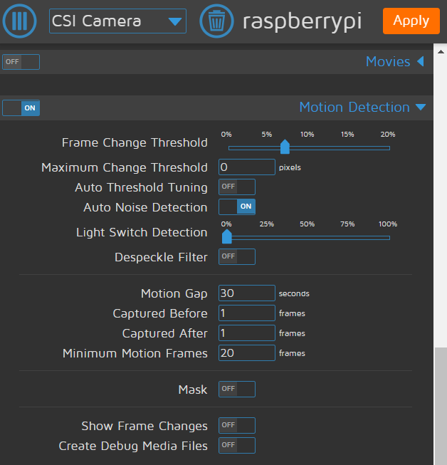<br /><br />

You should test yourself by changing the threshold values, other option values many times. Find your own values, because the appropriate values depends on the camera locations. 

#### store the videos, images on the NAS
At "File Storage", Enter the mounted NAS directory.
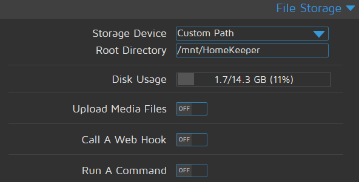<br /><br />

After modifying the options, Click the Apply button at upper left corner.
Now if your pi detects motions and it records detected images, videos on the NAS. I have successfully save images, videos on my NAS like this. You can view the images, videos using a browser. <br /><br />
```console
WDMyCloud:/shares/HomeKeeper# ls -al
total 16
drwxrwxrwx+ 3 root   share 4096 Sep 15 19:49 .
drwxrwxr-x  9 root   share 4096 Sep 15 16:31 ..
drwxr-xr-x  2 nobody share 4096 Sep 15 20:00 2019-09-15
WDMyCloud:/shares/HomeKeeper# ls -al 2019-09-15/
total 28840
drwxr-xr-x  2 nobody share     4096 Sep 15 20:00 .
drwxrwxrwx+ 3 root   share     4096 Sep 15 19:49 ..
-rw-r--r--  1 nobody share 13039456 Sep 15 19:49 19-48-48.mp4
-rw-r--r--  1 nobody share    22561 Sep 15 19:50 19-48-48.mp4.thumb
-rw-r--r--  1 nobody share    36016 Sep 15 19:50 19-49-57.jpg
-rw-r--r--  1 nobody share  3189554 Sep 15 19:50 19-49-57.mp4
-rw-r--r--  1 nobody share    17356 Sep 15 19:50 19-49-57.mp4.thumb
-rw-r--r--  1 nobody share    36315 Sep 15 19:50 19-49-58.jpg
-rw-r--r--  1 nobody share    36136 Sep 15 19:50 19-49-59.jpg
-rw-r--r--  1 nobody share    36244 Sep 15 19:50 19-50-00.jpg
-rw-r--r--  1 nobody share    36090 Sep 15 19:50 19-50-01.jpg
-rw-r--r--  1 nobody share    36035 Sep 15 19:54 19-54-07.jpg
-rw-r--r--  1 nobody share  3203328 Sep 15 19:54 19-54-07.mp4
-rw-r--r--  1 nobody share    17148 Sep 15 19:54 19-54-07.mp4.thumb
```
</br></br>

## Notifying events 
Altough you have finished installing motioneye raspberry pi, there's one thing to think about. When your pi detects motions and record the video, saves still images, how can you know? motioneye supports some built in notofications. Sending Email is the first one. But you won't know the incident until you check your email. If we can implement real time notification service, it would be a much better choice.</br></br>

#### No EMail but Push Service
Perhaps the best service is to use your mobile phone.  In this section I'm going to implement real time push service using free push services like pushetta, Pushbullet(100 free per month). There are also many paied service like Pushover, AWS SNS which provides more stable services. If you are interested, check it out at https://pushover.net/.  Free push services don't send via SMS, MMS. So there should be an app that can receive notification in your phone.
If you are good at Android or IOS development, you can make your own push service mobile app that receives notifications from motioneye pi. If you are not an mobile developer, you can also use a ready made app from Google Play.</br></br>

## Pushetta push service 
#### Signup Pushetta 
Visit http://www.pushetta.com/accounts/signup/ and make your account.
After logging in to Pushetta, goto Dashboard menu. You can see API Key like this.<br />
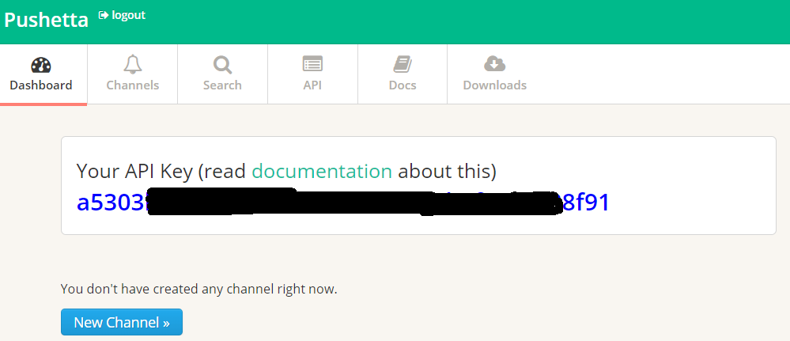<br /><br />

Don't others know your API Key. We will use this value later in our Python program.<br />
It's time to create a channel. Before Creating a channel, prepare 256X256 size png file. Then click the "New Channel" button and create a new channel like this. 
>⚠️ ***Warning***: Public channels can be seen by others and can be subscribed. So your pi notifications can be sent to others. If you want more secure service, use private channel. You should accept the subscription request from the phone on the Pushetta homepage when using a private channel. 

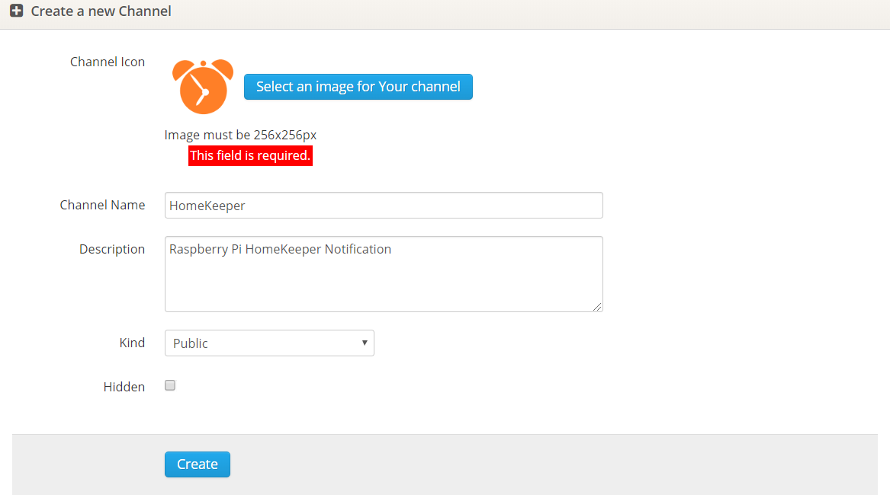<br /><br />

#### Pushetta android app
I'm using an android phone. So I'll install an android app from Google Play. If you are an IPhone user, You can find the same app from App Store.
 < Pushetta searched on Google Play  > <br /><br />
Install Pushetta App and configure a channel. Search for "HomeKeeper" in the Discover menu. If the search is success, you can see HomeKeeper channel that you made at Pushetta site, press add button.
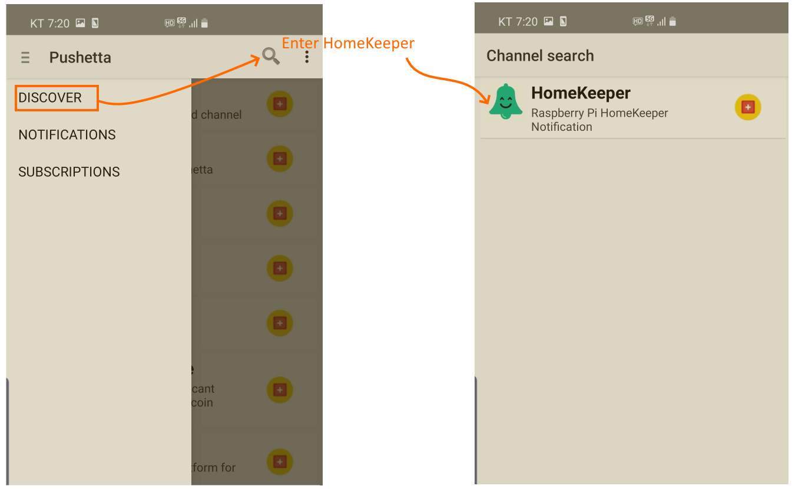<br /><br />

We have done phone work! Now lets's go back to motioneye and configure to send notifications from your pi.</br></br>

## Pushbullet push service 
Most push services are similar in usage. If you have trouble with the installation process, googling will help you.<br /><br />
#### Signup Pushbullet 
Visit https://www.pushbullet.com/ and make your account. 
After signing up, create a channel.
Then click the "Create Access Token" button to make Access Token. Don't others know your Access Token. We will use this value later in our Python program.<br />
<br /><br />

>⚠️ ***Warning***: Pushbullet only free 100 per month. If notification exceeds this value, your phone might not receive push messages. If you receive more than 100 notifications per month, consider using the pro version.

#### Pushbullet android app
Install Pushbullet App on your phone and sign in with the same account. 
>⚠️ ***Warning***: When installing Pushbullet on the Android phone, you should allow the permission requests and allow "Access notifications".

<br /><br />

## Sending notification from motioneye pi 
Altough you have finished installing motioneye raspberry pi, there's one thing to think about. When your pi detects motions and record the video, saves still images, how can you know? motioneye supports some built in notifications. Sending Email is the first one. But you won't know the incident until you check your email. If we can implement real time notification service, it would be a much better choice.

## Pushetta python code
Before making python code, install the required packages.
```console
pip install pushetta
```
The code for sending notification to your phone is very simple.

```python
from pushetta import Pushetta
    
API_KEY="your_pushetta_key"
CHANNEL_NAME="HomeKeeper"
p=Pushetta(API_KEY)
p.pushMessage(CHANNEL_NAME, "MotionEye detects strange movement. Pls check the NAS")
```


## Pushbullet push service
Before making python code, install the required packages.
```console
pip install pushbullet.py
```

The code for sending notification to your phone is very simple.
```python
#!/usr/bin/env python
from pushbullet import Pushbullet
api_key = "your_pushbullet_access_token"
pb = Pushbullet(api_key)
push = pb.push_note("title", "MotionEye detects strange movement. Pls check the NAS")
```
Let's run the code and check your phone. If everything is OK, you should get the notification like this.
```console
python bullet.py
```
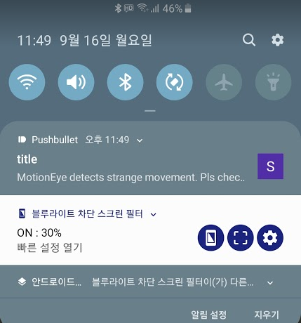<br /><br />


## Linking Python programs with motioneye
Let motioneye call the python scripts when it detects motions. Suppose you have a python file in your /usr/local/src directory.
IN motioneye settings, enable "Run As End Command", and enter the command "python /usr/local/src/bullet.py" 
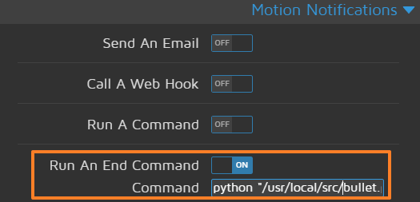<br /><br />

Now you can receive real time notifications when motioneye pi detects motions. Most NAS venders provide android, IOS apps that can navigate your NAS. When you receive a push notification from your pi, open your NAS app and you can see the images, videos on your NAS.
Happy HomeKeeping. ~~~